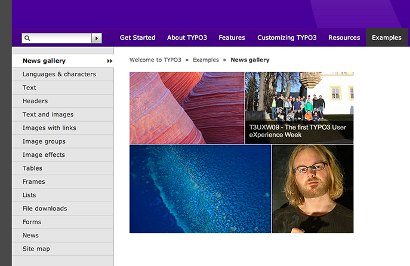
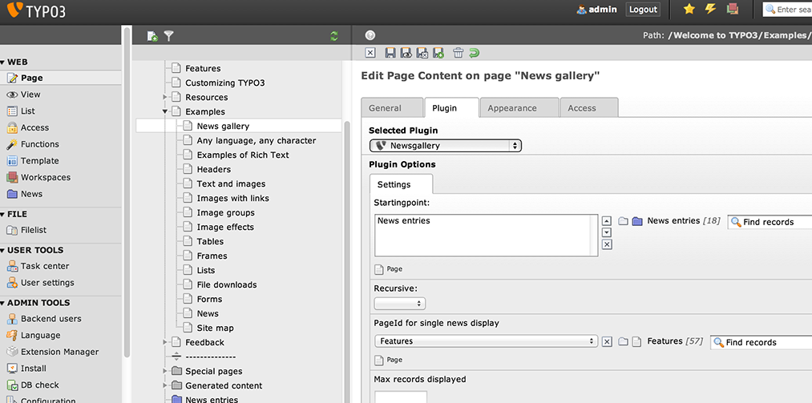

Introduction
============

What does it do?
----------------
This extension creates a gallery of images collected from news items. You should already have the [news](http://typo3.org/extensions/repository/view/news) extension installed and working in order to use this extension.

Rendering of the gallery is done using the jQuery plugin [Justified-Gallery](https://github.com/miromannino/Justified-Gallery).

Screenshots
-----------

Installation
============
* Install the extension through the Extension Manager
* Include the static template "Newsgallery (wizz_newsgallery)"
* Insert the Newsgallery plugin on a page
* In the plugin options select the folder where news items are located as the startingpoint and select a page for single news display

Configuration
=============
Available options are:

* Startingpoint: Should point to folder where news items are located
* Max records displayed: Limit the maximum number of images shown
* PageId for single news display: Clicking on an image will open the news item on this page
* To configure Justified-Gallery options, edit the template at EXT:wizz_newsgallery/Resources/Private/Templates/Newsgallery/Show.html (from line 19). See [Justified Gallery](http://miromannino.com/projects/justified-gallery/) for Justified-Gallery options

Notes
=====
* jQuery is required. This extension does not come with jQuery included. You should already have jQuery loaded
* 
